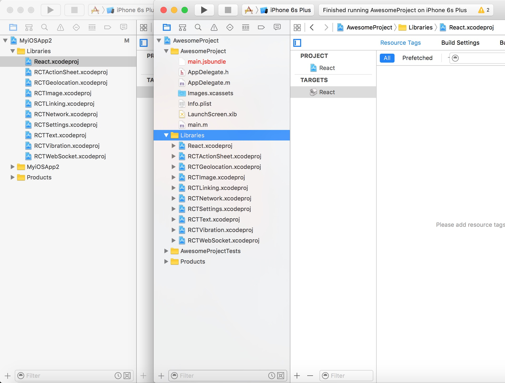
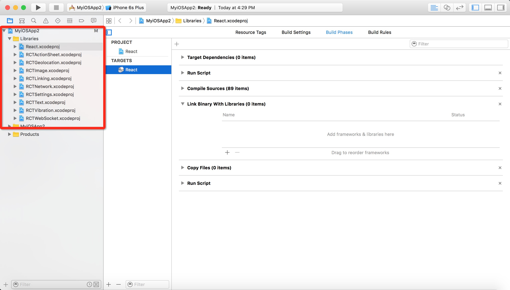
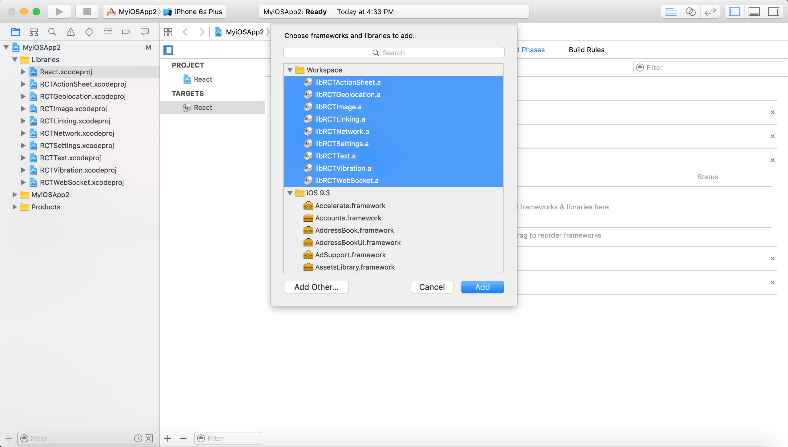

# 8.1 iOS

- 
## Cocoapods with local path

    Requirement : [CocoaPods](https://cocoapods.org/) 

    After pod **version > 1.0**, you need to identify the target. Create 'Podfile' in project root folder :
    ```
 target 'MyiOSApp' do 
	pod 'React', :path => '../../AwesomeProject/node_modules/react-native', :subspecs => [
  	  'Core',
  	  'RCTImage',
  	  'RCTNetwork',
  	  'RCTText',
  	  'RCTWebSocket',
	]
  end
    ```
    
  then ```pod install```
  
  
  
- ## Link react-native modules directly
  1. Open MyiOSApp2 and AwesomeProject/ios/AwesomeProject.xcodeproj in Xcode. Create group 'Libraries', drag all contents from AwesomeProject/Libraries. 
  2. Then close both and reopen MyiOSApp2, you'll find that the lib folder can be expanded!
  
  3. Click the build phases tab, and add all '.a' libs. 
  4. Build Settings -> Header Search Paths, add 
  
  


    

    
    