# React Native Training

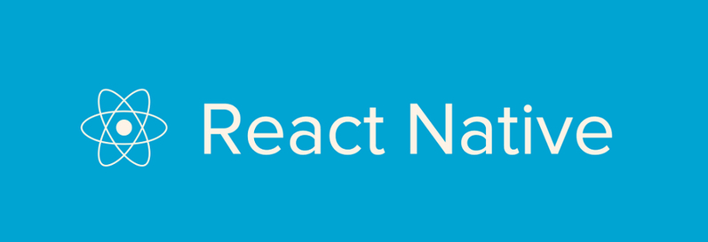

The videos are here - [Udemy](https://www.udemy.com/react-native-train/?couponCode=LUCKY-0)

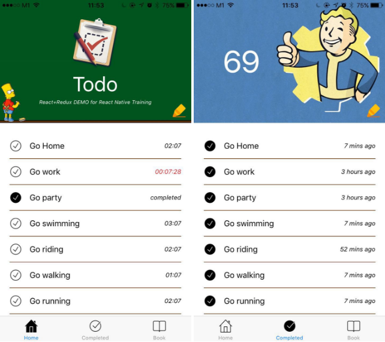

Please [leave a message](https://www.gitbook.com/book/unbug/react-native-training/discussions) or twitter [@unbug](https://twitter.com/unbug) for further inquiries. Any help will be appreciated :\)

# Table of contents

* [1 First look](#1-first-look)
  * [1.1 Building an app in 5 minutes](#11-building-an-app-in-5-minutes)
  * [1.2 How it works](#12-how-it-works)
  * [1.3 Debug tools](#13-debug-tools)
  * [1.4 DOCs & APIs](#14-docs--apis)
  * [1.5 Resources](#15-resources)
* [2 Components](#2-components)
  * [2.1 Render & JSX](#21-render--jsx)
  * [2.2 View, Text, Image, etc](#22-view-text-image-etc)
  * [2.3 Lifecyle](#23-lifecyle)
  * [2.4 Props & States](#24-props--states)
  * [2.5 Events](#25-events)
  * [2.6 Resources](#26-resources)
* [3 Styles](#3-styles)
  * [3.1 Flexbox](#31-flexbox)
  * [3.2 Absolute & Relative](#32-absolute--relative)
  * [3.3 Size & Dimensions & onLayout](#33-size--dimensions--onlayout)
  * [3.4 Inheritance](#34-inheritance)
  * [3.5 Resources](#35-resources)
* [4 Architecture](#4-architecture)
  * [4.1 Redux](#41-redux)
  * [4.2 react-redux](#42-react-redux)
  * [4.3 Containers & Components](#43-containers--components)
  * [4.4 Todo React Native App](#44-todo-react-native-app)
  * [4.5 Naming convention](#45-naming-convention)
  * [4.6 Resources](#46-resources)
* [5 Data](#5-data)
  * [5.1 Fetch](#51-fetch)
  * [5.2 Persistent](#52-persistent)
  * [5.3 Resources](#53-resources)
* [6 Router](#6-router)
  * [6.1 Navigator](#61-navigator)
  * [6.2 Resources](#62-resources)
* [7 Native Modules \(draft\)](#7-native-modules)
  * 7.1 iOS
    * 7.1.1 JS call OC
    * 7.1.2 OC call JS
    * 7.1.3 Native View Component
  * 7.2 Android
    * 7.2.1 JS call Java
    * 7.2.2 Java call JS
    * 7.2.3 Native View Component
  * 7.3 Resources
* [8 Integration \(draft\)](#8-integration)
  * [8.1 iOS](#81-ios)
    * [8.1.1 Package](#811-package)
    * 8.1.2 Image
  * [8.2 Android](#82-android)
    * [8.2.1 Package](#821-package)
    * 8.2.2 Image
  * [8.3 Before publishing](#83-before-publishing)
  * [8.4 Resources](#83-resources)
* [9 Hot Update \(draft\)](#9-hot-update-draf)
  * 9.1 iOS
  * 9.2 Android
  * 9.3 Resources
* [10 Performance \(draft\)](#10-performance)
  * [10.1 shouldComponentUpdate](#101-shouldcomponentupdate)
  * [10.2 Resources](#102-resources)
* [Resources](#resources)

---

# 1 First Look

[Introducing React Native](https://facebook.github.io/react/blog/2015/03/26/introducing-react-native.html)

> What we really want is the user experience of the native mobile platforms, combined with the developer experience we have when building with React on the web.  
> With a bit of work, we can make it so the exact same React that's on GitHub can power truly native mobile applications. The only difference in the mobile environment is that instead of running React in the browser and rendering to divs and spans, we run it an embedded instance of JavaScriptCore inside our apps and render to higher-level platform-specific components.  
> It's worth noting that we're not chasing **“write once, run anywhere.”** Different platforms have different looks, feels, and capabilities, and as such, we should still be developing discrete apps for each platform, but the same set of engineers should be able to build applications for whatever platform they choose, without needing to learn a fundamentally different set of technologies for each. We call this approach **“learn once, write anywhere.”**

[Showcase](https://facebook.github.io/react-native/showcase.html)


# 1.1 Building an app in 5 minutes

1. Requirement follow [Getting Started ](http://facebook.github.io/react-native/releases/next/docs/getting-started.html)
2. Generate a new React Native project
   ```shell
   react-native init testRn
   ```
3. Build & run project

   ```shell
   react-native run-ios
   ```

   or open `testRn/ios/testRn.xcodeproj` and build with XCode's play button

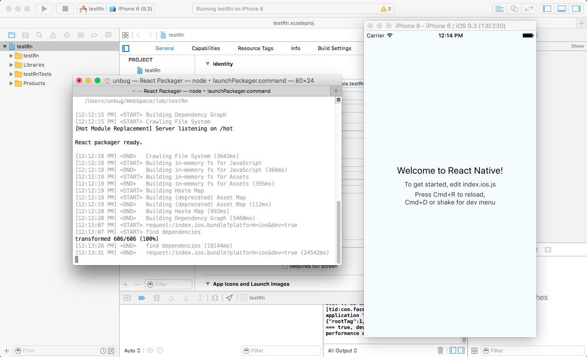

or if the app already builded, start the webserver

```shell
npm start
//or
react-native start
```

# 1.2 How it works

1.[JavaScript bridge](https://www.infoq.com/articles/react-native-introduction)

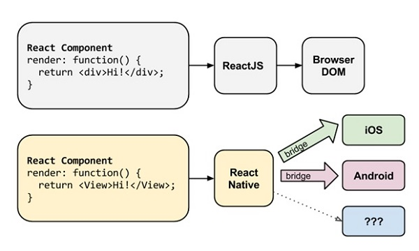

2.[React Native Packager](https://github.com/facebook/react-native/tree/master/packager)

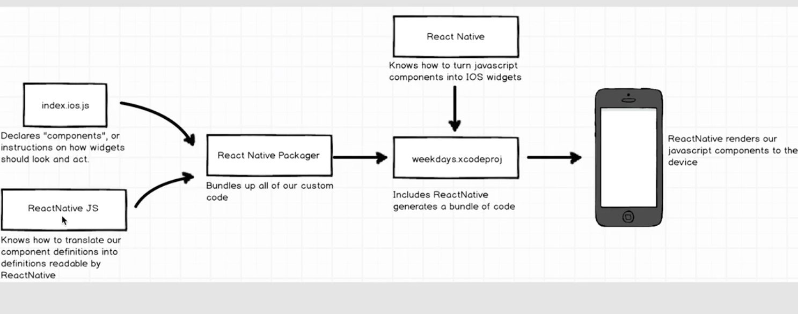

# 1.3 Debug tools

1.[developer menu](https://facebook.github.io/react-native/docs/debugging.html)

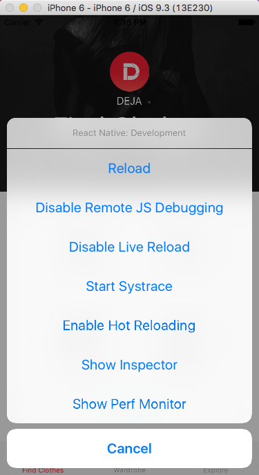

2.Chrome Devtools

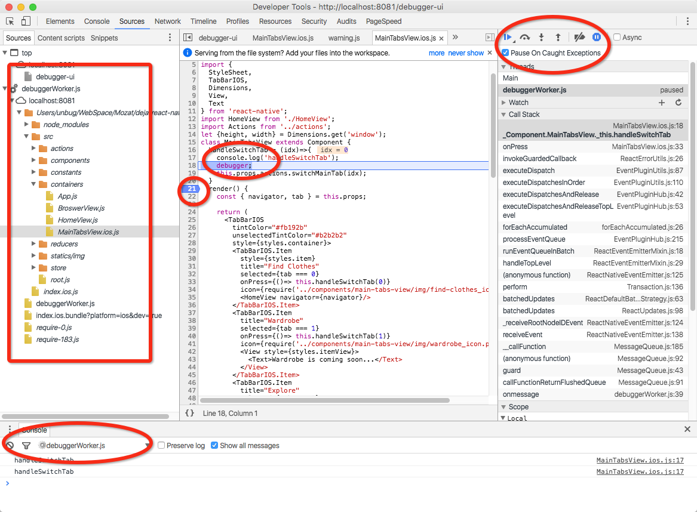  
3.log

```shell
console.log('some text');
console.dir({a:1, b:2, c:3});
debugger;//breaking point
```

4.[Atom](https://atom.io/) & [nuclide](https://nuclide.io/)

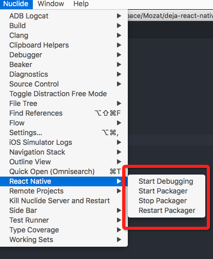

5.inspect

Open Atom [Command Palette package](https://atom.io/packages/command-palette) with `cmd-shift-p` and search "inspector", then click "Nuclide React Native Inspector:Show"

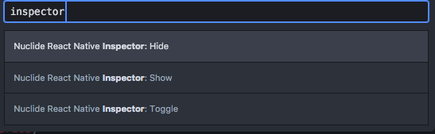

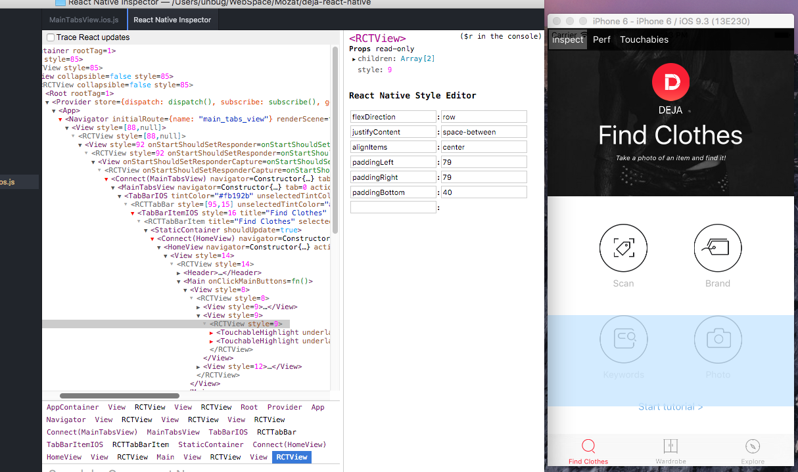

6.[Real device](https://facebook.github.io/react-native/docs/debugging.html#chrome-developer-tools)

6.1 Deploy to real device  
`project_name/ios/project_name/AppDelegate.m`

```c
  //jsCodeLocation = [NSURL URLWithString:@"http://localhost:8081/index.ios.bundle?platform=ios&dev=true"];

  /**
   * OPTION 2
   * Load from pre-bundled file on disk. The static bundle is automatically
   * generated by the "Bundle React Native code and images" build step when
   * running the project on an actual device or running the project on the
   * simulator in the "Release" build configuration.
   */

   jsCodeLocation = [[NSBundle mainBundle] URLForResource:@"main" withExtension:@"jsbundle"];
```

6.2 Debug in real device

1.`project_name/ios/project_name/AppDelegate.m`

```c
  jsCodeLocation = [NSURL URLWithString:@"http://172.28.0.230:8081/index.ios.bundle?platform=ios&dev=true"];
```

2.`node_modules/react-native/Libraries/WebSocket/RCTWebSocketExecutor.m`

```c
  if (!_url) {
    NSUserDefaults *standardDefaults = [NSUserDefaults standardUserDefaults];
    NSInteger port = [standardDefaults integerForKey:@"websocket-executor-port"] ?: 8081;
    NSString *URLString = [NSString stringWithFormat:@"http://172.28.0.230:%zd/debugger-proxy?role=client", port];
    _url = [RCTConvert NSURL:URLString];
  }
```

3.

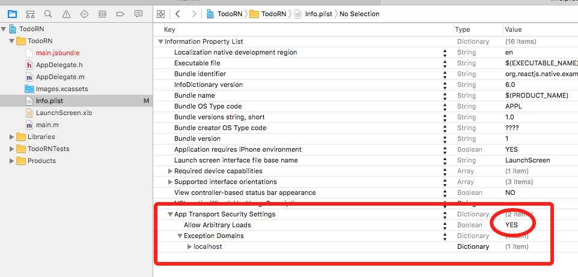

# 1.4 DOCs & APIs

* [ReactJS](https://facebook.github.io/react/docs/getting-started.html)
* [React Native](https://facebook.github.io/react-native/docs/getting-started.html)
* [Nuclide](https://nuclide.io/docs/quick-start/getting-started/)

# 1.5 Resources

* [React Native: Bringing modern web techniques to mobile](https://code.facebook.com/posts/1014532261909640/react-native-bringing-modern-web-techniques-to-mobile/)
* [React Native通信机制详解](http://blog.cnbang.net/tech/2698/)
* [React Native 调研报告](http://blog.csdn.net/lihuiqwertyuiop/article/details/45241909)
* [React Native概述：背景、规划和风险](https://github.com/tmallfe/tmallfe.github.io/issues/18)
* [JavaScriptCore](http://trac.webkit.org/wiki/JavaScriptCore)
* [React Native iOS 真机调试](http://www.jianshu.com/p/cc64bcb58df2)

# 2 Components

1.MyComponent.js

```javascript
//define component
class MyComponent extends React.Component {
  render() {
    return <Text>My component!</Text>;
  }
}
//export component
export default MyComponent;
```

2.Main.js

```javascript
//import component
import MyComponent from './MyComponent';
class Main extends React.Component {
  render() {
    //use component
    return <MyComponent>;
  }
}
```

3.AppRegistry

```javascript
AppRegistry.registerComponent('MyApp', () => Main);
```

# 2.1 Render & JSX

```javascript
..
...
render() {
  const txt = 'Hello';
  function say(name){
    return 'I am '+name;
  }
  return (
    <View>
      <Text>This is a title!</Text>
      <Text>{txt}</Text>
      <View>
        <Text>{say('React')}</Text>
      </View>
    </View>
  );
}
..
...
```

# 2.2 View, Text, Image, etc

1. [Core Components](https://facebook.github.io/react-native/docs/tutorial-core-components.html)

```javascript
..
...
import {
  StyleSheet,
  Text,
  View,
  Image
} from 'react-native';

class Main extends Component {
  render() {
    return (
      <View>
        <Image source={require('./img/bg.png')}>
          <Image source={require('./img/icon.png')}/>
          <Text>
            some text!
          </Text>
        </Image>
      </View>
    );
  }
}
```

# 2.3 Lifecyle

1. Instantiation

   1.1 The lifecycle methods that are called the first time an instance is created

   * getDefaultProps
   * **getInitialState**
   * componentWillMount
   * **render**
   * **componentDidMount**

   1.2 For all subsequent uses of that component class:

   * getInitialState
   * componentWillMount
   * render
   * componentDidMount”

2. Lifetime

   * componentWillReceiveProps
   * **shouldComponentUpdate // return true\|false**
     ```javascript
     shouldComponentUpdate(nextProps, nextState) {
     return nextProps.id !== this.props.id;
     }
     ```
   * componentWillUpdate //not called for the initial render
   * render
   * componentDidUpdate

3. Teardown & cleanup

   * componentWillUnmount

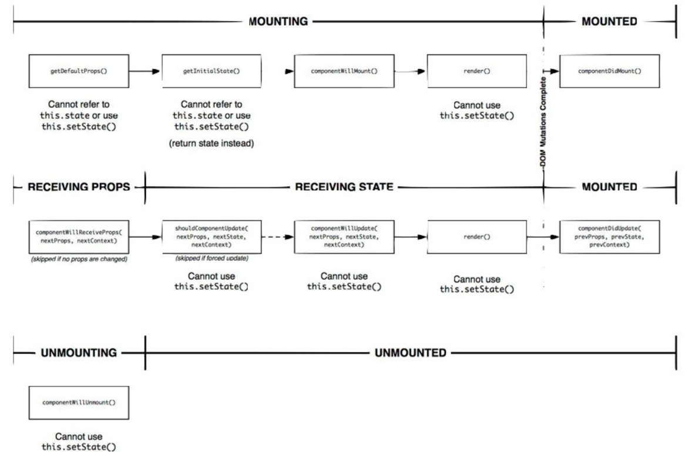

# 2.4 Props & States

1.props: properties are passed to a component and can hold any data

```javascript
class User extends Component {
  render(){
    const user = this.props.data;
    this.props.onReady('I am ready!');
    return(
      <View>
        <Text>
          score: {this.props.score}
          type: {this.props.type}
          Name: {user.name}
          Age: {user.age}
        </Text>
      </View>
    );
  }
}
//dufaultProps
User.propTypes = { score: React.PropTypes.number };
User.defaultProps = { score: 0 };

var user = {name: 'foo', age: 21};
class Main extends Component {
  handleReady(str){
    console.log(str);
  }
  render(){
    return(
      <View>
        <User type="Dev" data={user} onReady={this.handleReady}/>
      </View>
    );
  }
}
```

2.state: State differs from props in that it is internal to the component.

```javascript
class Timer extends Component {
  constructor(props) {
    super(props);
    this.state = {count: 0};
  }

  componentDidMount() {
    let that = this;
    setInterval(function () {
      that.increase();
    }, 1000);
  }

  increase() {
    this.setState({count: this.state.count + 1});
  }

  render() {
    return (
      <View>
        <Text>count: {this.state.count}</Text>
      </View>
    );
  }
}

class Main extends Component {
  render(){
    return(
      <View>
        <Timer/>
      </View>
    );
  }
}
```

3._props_ VS _state_

* Use props to pass data and settings through the component tree.
* Never modify this.props inside of a component; consider props immutable.
* Use props to for event handlers to communicate with child components.
* Use state for storing simple view state like wether or not drop-down options are visible.
* Never modify this.state directly, use this.setstate instead.

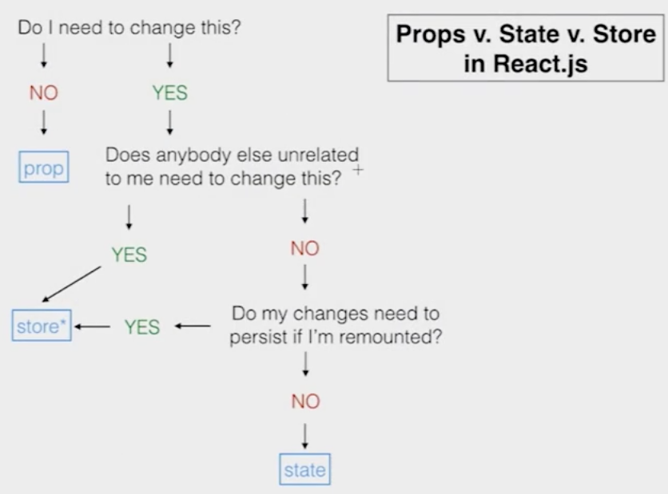

4.Stateless Component

```javascript
const Heading = ({title}) => <Text>{title}</Text>;

..
...
<Heading title="test title"/>
...
..
```

# 2.5 Events

1.Basic events

1.1.[`<TouchableHighlight/>`](https://facebook.github.io/react-native/docs/touchablehighlight.html)

```javascript
class Touch extends Component {
  handlePress(){
    console.log('press');
  }
  handleLongPress(){
    console.log('longPress');
  }
  render() {
    return (
      <TouchableHighlight
        onPress={this.handlePress}
        onLongPress={this.handleLongPress}>
        <View>
          <Text>Press me!</Text>
        </View>
      </TouchableHighlight>
    );
  }
}
```

1.2. [`<TextInput/>`](https://facebook.github.io/react-native/docs/textinput.html)

```javascript
class Test extends Component {
  //...
  //handle events
  //...
  render() {
    return (
      <TextInput 
        onBlur={...}
        onChange={...}
        onEndEditing={...}
        onSelectionChange={...}
        onSubmitEditing={...}
      </TextInput>
    );
  }
}
```

1.3.[DeviceEventEmitter](https://kpetrovi.ch/2015/09/30/react-native-ios-keyboard-events.html)

```javascript
//keyboardWillShow, keyboardDidShow, keyboardWillHide, keyboardDidHide
//keyboardWillChangeFrame, keyboardDidChangeFrame
//add the listener
 var listener = DeviceEventEmitter.addListener('keyboardWillShow', (e) =>{
   console.log('Event is fired!');
 });
 //remove the listener
 listener.remove();
```

2.[Gesture Responder System](https://facebook.github.io/react-native/docs/gesture-responder-system.html#responder-lifecycle)

2.1 Lifecycle  
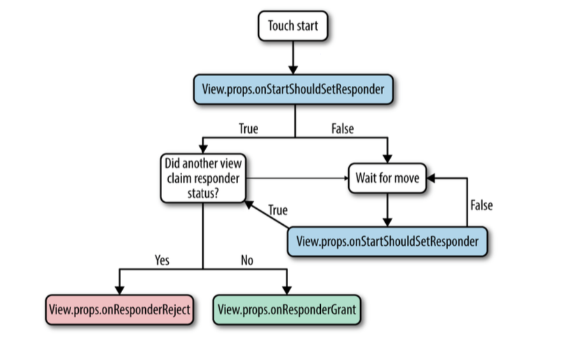  
 2.2 example

```javascript
class Test extends Component {
  /* Capture handles */
  //the responder system bubbles up from the deepest component, 
  //a parent View wants to prevent the child from becoming responder on a touch start
  handleStartShouldSetResponderCapture(evt){
    return true;
  }
  //the responder system bubbles up from the deepest component, 
  //a parent View wants to prevent the child from becoming responder on a touch move
  handleMoveShouldSetResponderCapture(evt){
    return true;
  }

  /* Lifecycle handles */
  //Does this view want to become responder on the start of a touch?
  handleStartShouldSetResponder(evt){
    return true;
  }
  //Called for every touch move on the View when it is not the responder: 
  //does this view want to "claim" touch responsiveness?
  handleMoveShouldSetResponder(evt){
    return true;
  }
  //The View is now responding for touch events. 
  handleResponderGrant(evt){
    console.log('you are touching me');
  }
  //Something else is the responder right now and will not release it
  handleResponderReject(evt){
    console.log('please wait in line');
  }

  /* event handles */
  //touch move
  handleResponderMove(evt){
    console.log('touch move at:', 'X='+evt.pageX, 'Y='+evt.pageY);
  }
  //touch end/up
  handleResponderRelease(evt){
    console.log('touch end');
  }
  //Something else wants to become responder. Should this view release the responder?
  handleResponderTerminationRequest(evt){
    return true;
  }
  //touch cancel
  handleResponderTerminate(evt){
    console.log('touch canceled');
  }
  render() {
    return (
      <View 
        onStartShouldSetResponderCapture={this.handleStartShouldSetResponderCapture}
        onMoveShouldSetResponderCapture={this.handleMoveShouldSetResponderCapture}
        onStartShouldSetResponder={this.handleStartShouldSetResponder}
        onMoveShouldSetResponder={this.handleMoveShouldSetResponder}
        onResponderGrant={this.handleResponderGrant} 
        onResponderReject={this.handleResponderReject}
        onResponderMove={this.handleResponderMove}
        onResponderRelease={this.handleResponderRelease}
        onResponderTerminationRequest={this.handleResponderTerminationRequest}
        onResponderTerminate={this.handleResponderTerminate}>
          <Text>Press me!</Text>
      </View>
    );
  }
}
```

2.3 evt is a synthetic touch event with the following form nativeEvent:

* changedTouches - Array of all touch events that have changed since the last event
* identifier - The ID of the touch
* locationX - The X position of the touch, relative to the element
* locationY - The Y position of the touch, relative to the element
* pageX - The X position of the touch, relative to the root element
* pageY - The Y position of the touch, relative to the root element
* target - The node id of the element receiving the touch event
* timestamp - A time identifier for the touch, useful for velocity calculation
* touches - Array of all current touches on the screen

3.[PanResponder](https://facebook.github.io/react-native/docs/panresponder.html)

3.1

```javascript
this._panResponder = PanResponder.create({
  // Ask to be the responder:
  onStartShouldSetPanResponder: (evt, gestureState) => true,
  onStartShouldSetPanResponderCapture: (evt, gestureState) => true,
  onMoveShouldSetPanResponder: (evt, gestureState) => true,
  onMoveShouldSetPanResponderCapture: (evt, gestureState) => true,
  //touch start
  onPanResponderGrant: (evt, gestureState) => {},
  //touch move
  onPanResponderMove: (evt, gestureState) => {},
  onPanResponderTerminationRequest: (evt, gestureState) => true,
  //touch end/up
  onPanResponderRelease: (evt, gestureState) => {},
  //touch cancel
  onPanResponderTerminate: (evt, gestureState) => {},
  onShouldBlockNativeResponder: (evt, gestureState) => true,
});
```

3.2 A gestureState object has the following:

* stateID - ID of the gestureState- persisted as long as there at least one touch on screen
* moveX - the latest screen coordinates of the recently-moved touch
* moveY - the latest screen coordinates of the recently-moved touch
* x0 - the screen coordinates of the responder grant
* y0 - the screen coordinates of the responder grant
* dx - accumulated distance of the gesture since the touch started
* dy - accumulated distance of the gesture since the touch started
* vx - current velocity of the gesture
* vy - current velocity of the gesture
* numberActiveTouches - Number of touches currently on screen

3.3 [PanResponder example in UIExplorer](https://github.com/facebook/react-native/blob/master/Examples/UIExplorer/PanResponderExample.js)

# 2.6 Resources

* [react.parts](https://react.parts/native)
* [js.coach](https://js.coach/)
* [props vs state](https://github.com/uberVU/react-guide/blob/master/props-vs-state.md)
* [Thinking in React](https://facebook.github.io/react/docs/thinking-in-react.html)
* [JSX in Depth](https://facebook.github.io/react/docs/jsx-in-depth.html)
* [DEMO scripts for this chapter](https://github.com/unbug/react-native-train-scripts)

# 3 Styles

1.Declare Style

```javascript
const styles = StyleSheet.create({
  container: {
    flex: 1,
    backgroundColor: 'blue',
  },
  text: {
    fontSize: 14,
    color: 'red'
  }
});
```

2.Using Styles

```javascript
class Main extends Component {
  render() {
    return (
      <View style={styles.container}>
        <Text style={styles.text}>I am red.</Text>
      </View>
    );
  }
}
```

3.Properties

* [View Properties](https://facebook.github.io/react-native/docs/view.html#style)
* [Image Properties](https://facebook.github.io/react-native/docs/image.html#style)
* [Text Properties](https://facebook.github.io/react-native/docs/text.html#style)
* [Flex Properties](https://facebook.github.io/react-native/docs/flexbox.html#content)
* [Transform Properties](https://facebook.github.io/react-native/docs/transforms.html#content)

# 3.1 Flexbox

1.[Flexbox layout](https://css-tricks.com/snippets/css/a-guide-to-flexbox/)

> The main idea behind the flex layout is to give the container the ability to alter its items' width/height \(and order\) to best fill the available space \(mostly to accommodate to all kind of display devices and screen sizes\). A flex container expands items to fill available free space, or shrinks them to prevent overflow.

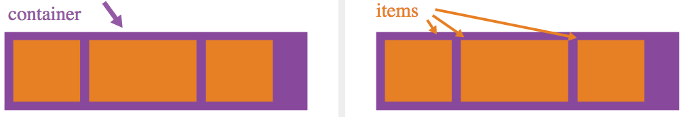

2.flex:1

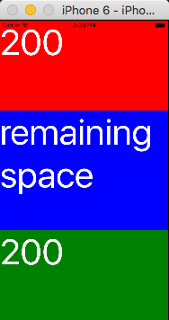

```javascript
const styles = StyleSheet.create({
  container: {
    flex: 1
  },
  header: {
    height: 200,
    backgroundColor: 'red'
  },
  main: {
    flex: 1,
    backgroundColor: 'blue'
  },
  footer: {
    height: 200,
    backgroundColor: 'green'
  },
  text: {
    color: '#ffffff',
    fontSize: 80
  }
});
```

3.flexDirection:'row'\|'column'

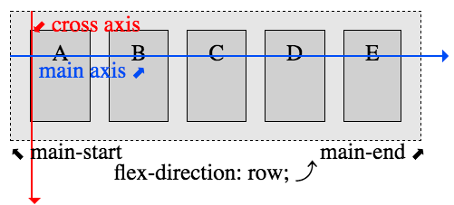

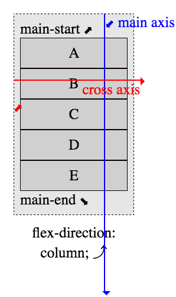

4.justifyContent:'flex-start'\|'flex-end'\|'center'\|'space-between'\|'space-around'

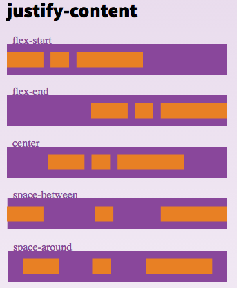

5.alignItems:'flex-start'\|'flex-end'\|'center'\|'stretch'

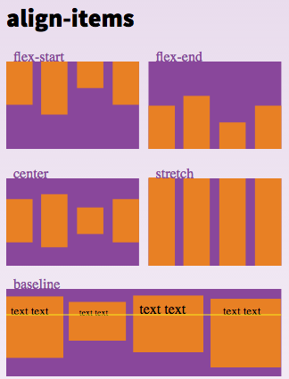

6.alignSelf:'auto'\|'flex-start'\|'flex-end'\|'center'\|'stretch'

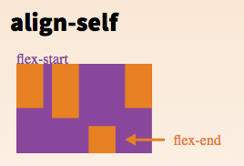

7.flexWrap:'wrap'\|'nowrap'

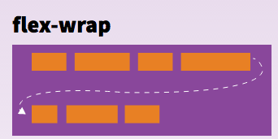

8.Box model

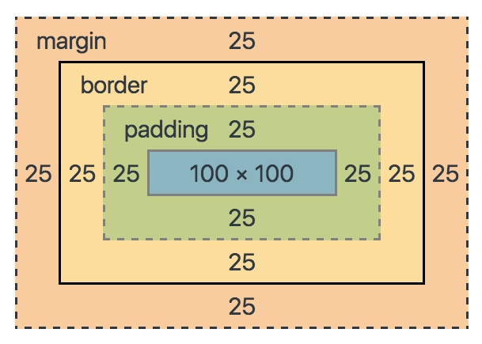

width = borderLeftWidth\(25\)+paddingLeft\(25\)+100+borderRightWidth\(25\)+paddingRight\(25\)=200

height = borderTopWidth\(25\)+paddingTop\(25\)+100+borderBottomWidth\(25\)+paddingBottom\(25\)=200

```javascript
class Main extends Component {
  render() {
    return (
      <View style={styles.container}>
        <View style={styles.header}>
          <Text style={styles.text}>200X100</Text>
        </View>
        <View style={styles.main}>
          <View  style={styles.mainContent}>
            <Text style={styles.text}>100X100</Text>
          </View>
        </View>
        <View style={styles.footer}>
          <Text style={styles.text}>200X100</Text>
        </View>
      </View>
    );
  }
}

const styles = StyleSheet.create({
  container: {
    flex: 1,
    justifyContent: 'center',
    alignItems: 'center'
  },
  header: {
    height: 100,
    width: 200,
    backgroundColor: 'red'
  },
  main: {
    height: 200,
    width: 200,
    padding: 25,
    borderWidth: 25,
    borderColor: 'black',
    margin: 25,
    backgroundColor: 'blue'
  },
  mainContent: {
    flex: 1,
    justifyContent: 'center',
    alignItems: 'center',
    backgroundColor: 'red'
  },
  footer: {
    height: 100,
    width: 200,
    backgroundColor: 'green'
  },
  text: {
    color: '#ffffff',
    fontSize: 20
  }
});
```

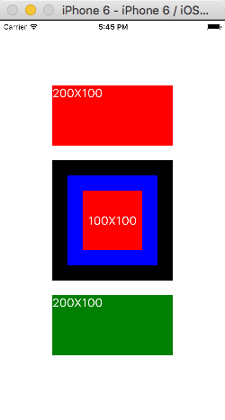

# 3.2 Absolute & Relative

1.absolute

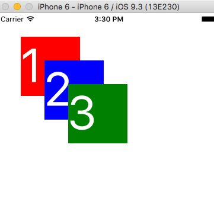

```javascript
class Position extends Component {
  render() {
    return (
      <View style={styles.container}>
        <View style={styles.box1}>
          <Text style={styles.text}>1</Text>
        </View>
        <View style={styles.box2}>
          <Text style={styles.text}>2</Text>
        </View>
        <View style={styles.box3}>
          <Text style={styles.text}>3</Text>
        </View>
      </View>
    );
  }
}
const styles = StyleSheet.create({
  container: {
    flex: 1
  },
  box1: {
    position: 'absolute',
    top: 40,
    left: 40,
    width: 100,
    height: 100,
    backgroundColor: 'red'
  },
  box2: {
    position: 'absolute',
    top: 80,
    left: 80,
    width: 100,
    height: 100,
    backgroundColor: 'blue'
  },
  box3: {
    position: 'absolute',
    top: 120,
    left: 120,
    width: 100,
    height: 100,
    backgroundColor: 'green'
  },
  text: {
    color: '#ffffff',
    fontSize: 80
  }
});
```

2.zIndex, [v0.29](https://github.com/facebook/react-native/commit/d64368b9e239b574039f4a6508bf2aeb0806121b) or [transform](http://facebook.github.io/react-native/docs/transforms.html)

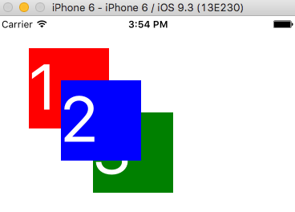

```javascript
  box2: {
    position: 'absolute',
    top: 80,
    left: 80,
    width: 100,
    height: 100,
    backgroundColor: 'blue',
    transform: [{'translate': [0,0, 1]}]
  },
```

3.relative\(default\)

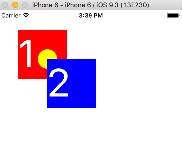

```javascript
class Relative extends Component {
  render() {
    return (
      <View style={styles.container}>
        <View style={styles.box1}>
          <Text style={styles.text}>1</Text>
          <View style={styles.ball}/>
        </View>
        <View style={styles.box2}>
          <Text style={styles.text}>2</Text>
        </View>
      </View>
    );
  }
}
const styles = StyleSheet.create({
  container: {
    flex: 1
  },
  box1: {
    position: 'relative',
    top: 40,
    left: 40,
    width: 100,
    height: 100,
    backgroundColor: 'red'
  },
  box2: {
    position: 'absolute',
    top: 100,
    left: 100,
    width: 100,
    height: 100,
    backgroundColor: 'blue'
  },
  ball: {
    position: 'absolute',
    top: 40,
    left: 40,
    width: 40,
    height: 40,
    borderRadius: 20,
    backgroundColor: 'yellow'
  },
  text: {
    color: '#ffffff',
    fontSize: 80
  }
});
```

4.fixed

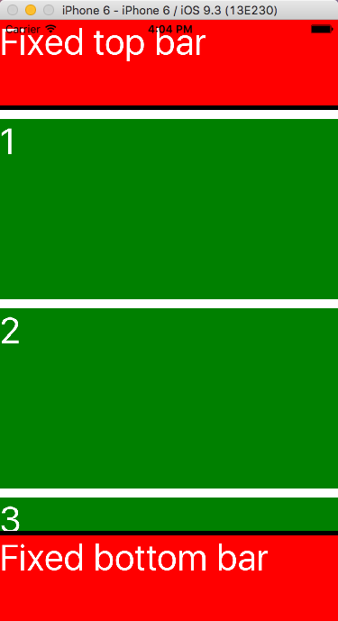

```javascript
class Fixed extends Component {
  render() {
    return (
      <View style={styles.container}>
        <View style={styles.tbar}>
          <Text style={styles.text}>Fixed top bar</Text>
        </View>
        <ScrollView style={styles.main}>
          <View style={styles.item}><Text style={styles.text}>1</Text></View>
          <View style={styles.item}><Text style={styles.text}>2</Text></View>
          <View style={styles.item}><Text style={styles.text}>3</Text></View>
        </ScrollView>
        <View style={styles.bbar}>
          <Text style={styles.text}>Fixed bottom bar</Text>
        </View>
      </View>
    );
  }
}
const styles = StyleSheet.create({
  container: {
    flex: 1
  },
  tbar: {
    width: 375,
    height: 100,
    borderBottomWidth: 5,
    borderColor: 'black',
    backgroundColor: 'red'
  },
  main: {
    flex: 1
  },
  item: {
    height: 200,
    width: 375,
    marginTop: 10,
    backgroundColor: 'green'
  },
  bbar: {
    width: 375,
    height: 100,
    borderTopWidth: 5,
    borderColor: 'black',
    backgroundColor: 'red'
  },
  text: {
    color: '#ffffff',
    fontSize: 40
  }
});
```

# 3.3 Size & Dimensions & onLayout

1.window size

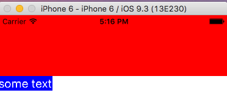

```javascript
let winSize = Dimensions.get('window');
console.log(winSize);
class Size extends Component {
  render() {
    return (
      <View style={styles.container}>
        <View style={styles.block}/>
        <Text style={styles.text}>some text</Text>
      </View>
    );
  }
}
const styles = StyleSheet.create({
  container: {
    flex: 1,
    alignItems: 'flex-start'
  },
  block: {
    height: 100,
    width: winSize.width,
    backgroundColor: 'red'
  },
  text: {
    color: '#ffffff',
    fontSize: 40/winSize.scale,
    backgroundColor: 'blue'
  }
});
```

2.[onLayout](http://facebook.github.io/react-native/releases/0.28/docs/view.html#onlayout)

```javascript
class Size extends Component {
  handleTextLayout(evt){
    console.log(evt.nativeEvent.layout);
  }
  render() {
    return (
      <View style={styles.container}>
        <View style={styles.block}/>
        <Text style={styles.text}
          onLayout={this.handleTextLayout}>some text</Text>
      </View>
    );
  }
}
```

# 3.4 Inheritance

1.pass styles as props

```javascript
class InheritanceStyle extends Component {
  render() {
    return (
      <View style={this.props.parentColor}>
      </View>
    );
  }
}

class Main extends Component {
  handleReady(str){
    console.log(str);
  }
  render() {
    return (
      <View style={styles.container}>
        <InheritanceStyle parentColor={styles.blue}/>
      </View>
    );
  }
}
const styles = StyleSheet.create({
  container: {
    flex: 1
  },
  blue: {
    flex: 1,
    backgroundColor: 'blue'
  }
});
```

2.concatenation styles

BaseStyles.js

```javascript
import { StyleSheet,Dimensions } from 'react-native';
let winSize = Dimensions.get('window');
const BaseStyles = StyleSheet.create({
  text: {
    fontSize: 40/winSize.scale
  }
});
export default BaseStyles;
```

```javascript
import BaseStyles from './BaseStyles';

class InheritanceStyle extends Component {
  render() {
    return (
      <View style={this.props.parentColor}>
        <Text style={[BaseStyles.text, styles.text]}> this is a long text </Text>
      </View>
    );
  }
}
const styles = StyleSheet.create({
  text:{
    color: '#ffffff'
  }
});
```

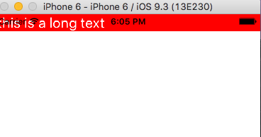

# 3.5 Resources

* [A Complete Guide to Flexbox](https://css-tricks.com/snippets/css/a-guide-to-flexbox/)
* [A Visual Guide to CSS3 Flexbox Properties](https://scotch.io/tutorials/a-visual-guide-to-css3-flexbox-properties)
* [Understanding Flex Direction](http://www.standardista.com/understanding-flex-direction/)
* [DEMO scripts for this chapter](https://github.com/unbug/react-native-train-scripts)

# 4 Architecture

1.MVC problems

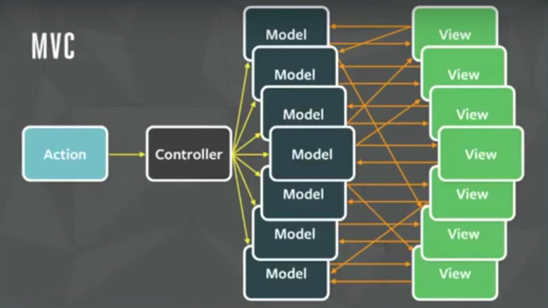

2.[Flux](http://facebook.github.io/flux/docs/overview.html)

  
3.Data flow

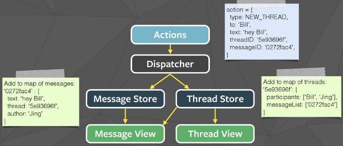

[Flux TodoMVC Example](https://github.com/facebook/flux/tree/master/examples/flux-todomvc/)

# 4.1 Redux

1.[Actions](https://github.com/acdlite/flux-standard-action) & Action Creators

```javascript
//action type
const ADD_TODO = 'ADD_TODO';

//action creator, semantic methods that create actions
//collected together in a module to become an API
function addTodoAction(title, hour) {
  //action, an object with a type property and new data, like events
  return {type: ADD_TODO, title, hour}
}
```

2.[Reducers](http://redux.js.org/docs/basics/Reducers.html)

```javascript
//a function that accepts an accumulation and a value and returns a new accumulation.
function todoReducers(state = [], action) {
  switch (action.type) {
    case ADD_TODO:
      //always return a new state, never mutate old state
      return [
        {
          id: Utils.GUID(),
          title: action.title,
          endTime: getEndTime(action.hour),
          completed: false
        },
        ...state
      ]
    default:
      //return default state
      return state
  }
}
```

3.Store

```javascript
import { createStore } from 'redux';
//1. define store
let store = createStore(todoReducers);

class App extends Component {
  constructor(props){
    super(props);
    this.state = {todos: []};
  }
  componentDidMount(){
    //2. subscribe store
    this.unsubscribeStore = store.subscribe(() =>{
      //3. getState
      this.setState({todos: store.getState()});
    });
  }
  componentWillUnmount(){
    //5. unsubscribe store
    this.unsubscribeStore();
  }
  renderTodoList = ()=>{
    //reder todo list
    return this.state.todos.map( (todo)=> {
      return <Text key={todo.id}>Todo: {todo.title}</Text>
    });
  }
  handleAddTodo = ()=>{
    //4. dispatching actions
    store.dispatch( addTodoAction('Create a new todo', 8) );
  }
  render() {
    return (
      <View>
        <TouchableHighlight onPress={this.handleAddTodo}>
          <Text>Add Todo</Text>
        </TouchableHighlight>
        <ScrollView>{this.renderTodoList()}</ScrollView>
      </View>
    );
  }
}
```

4.Data flow

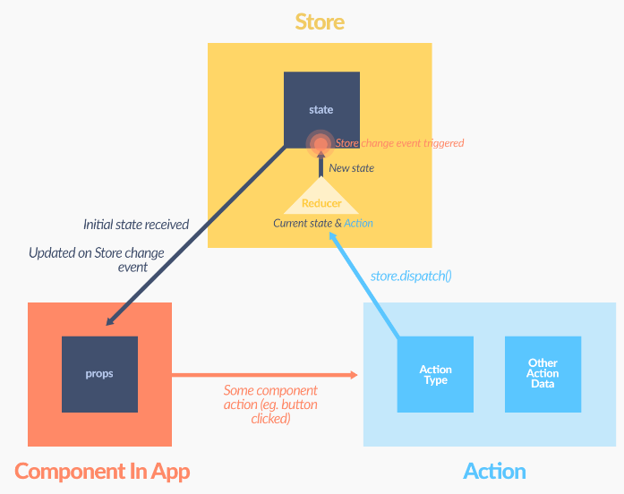

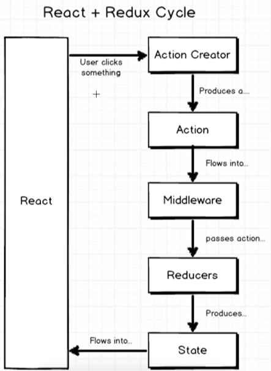

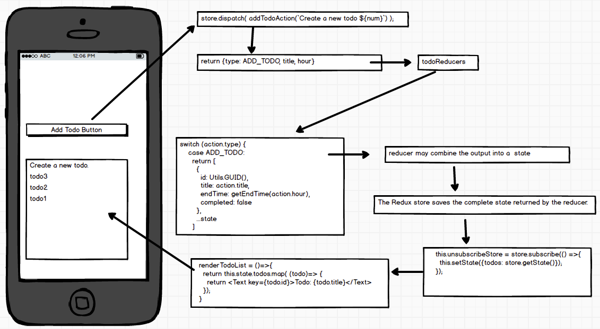

# 4.2 [react-redux](https://github.com/reactjs/react-redux)

1.Actions

```javascript
import * as  navigationActions from './navigation';
import * as  todosActions from './todos';

export default {...navigationActions, ...todosActions};
```

2.combineReducers\(\)

```javascript
import { combineReducers } from 'redux';
import navigation from './navigation';
import todos from './todos';

const rootReducer = combineReducers({
  navigation, todos
});

export default rootReducer;
```

3.Application state by configureStore\(\)

```javascript
import { createStore } from 'redux';
import reducers from '../reducers';

export default function configureStore() {
  const store = createStore(reducers);
  return store;
}
```

4.mapStateToProps & mapDispatchToProps & bindActionCreators

```javascript
import { bindActionCreators } from 'redux';
import { connect } from 'react-redux';

class App extends Component {
  renderTodoList = ()=>{
    //reder todo list
    return this.props.todos.map( (todo)=> {
      return <Text key={todo.id}>Todo: {todo.title}</Text>
    });
  }
  handleAddTodo = ()=>{
    this.props.actions.addTodoAction('Create a new todo', 8);
  }
  render() {
    return (
      <View>
        <TouchableHighlight onPress={this.handleAddTodo}>
          <Text>Add Todo</Text>
        </TouchableHighlight>
        <ScrollView>{this.renderTodoList()}</ScrollView>
      </View>
    );
  }
}

function mapStateToProps(state) {
  return {
    todos: state.todos
  };
}

function mapDispatchToProps(dispatch) {
  return {
    actions: bindActionCreators(Actions, dispatch)
  }
}

export default connect(
  mapStateToProps,
  mapDispatchToProps
)(App);
```

5.Passing the Store with `<Provider/>`

```javascript
import React, { Component } from 'react';
import { Provider } from 'react-redux';

import App from './containers/App';
import configureStore from './store/configureStore';

class Root extends Component {
  render() {
    return (
      <Provider store={configureStore()}>
        <App />
      </Provider>
    );
  }
}

export default Root;
```

# 4.3 Containers & Components

1.[Presentational and Container Components](http://redux.js.org/docs/basics/UsageWithReact.html)

<table>
    <thead>
        <tr>
            <th></th>
            <th scope="col" style="text-align:left">Presentational Components</th>
            <th scope="col" style="text-align:left">Container Components</th>
        </tr>
    </thead>
    <tbody>
        <tr>
          <th scope="row" style="text-align:right">Purpose</th>
          <td>How things look (markup, styles)</td>
          <td>How things work (data fetching, state updates)</td>
        </tr>
        <tr>
          <th scope="row" style="text-align:right">Aware of Redux</th>
          <td>No</th>
          <td>Yes</th>
        </tr>
        <tr>
          <th scope="row" style="text-align:right">To read data</th>
          <td>Read data from props</td>
          <td>Subscribe to Redux state</td>
        </tr>
        <tr>
          <th scope="row" style="text-align:right">To change data</th>
          <td>Invoke callbacks from props</td>
          <td>Dispatch Redux actions</td>
        </tr>
        <tr>
          <th scope="row" style="text-align:right">Are written</th>
          <td>By hand</td>
          <td>Usually generated by React Redux</td>
        </tr>
    </tbody>
</table>

2.`components/home-view` & `containers/HomeView`

2.1 home-view components

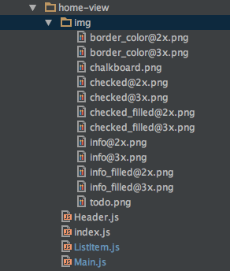

2.2 HomeView container

```javascript
import {
  Header,
  Main,
} from '../components/home-view';
import Actions from '../actions';

class HomeView extends Component {
  render() {
    return (
      <View>
        <Header {...this.props}/>
        <Main {...this.props} isVisible={this.state.isVisible}/>
      </View>
    );
  }
}

function mapStateToProps(state) {
  return {
    todos: state.todos
  };
}

function mapDispatchToProps(dispatch) {
  return {
    actions: bindActionCreators(Actions, dispatch)
  }
}

export default connect(
  mapStateToProps,
  mapDispatchToProps
)(HomeView);
```

# 4.4 [Todo React Native App](https://github.com/unbug/TodoRN)

1.Overview

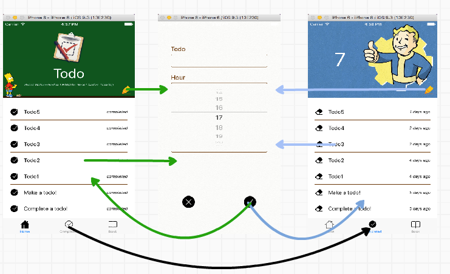

2.Structure

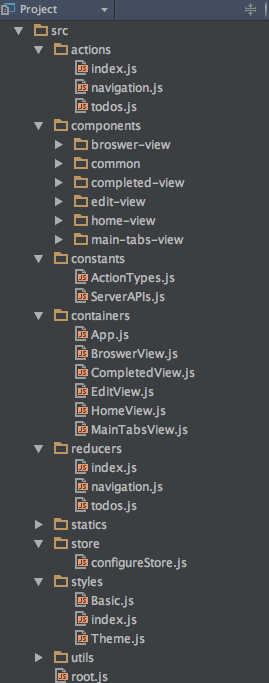

3.Containers & Components

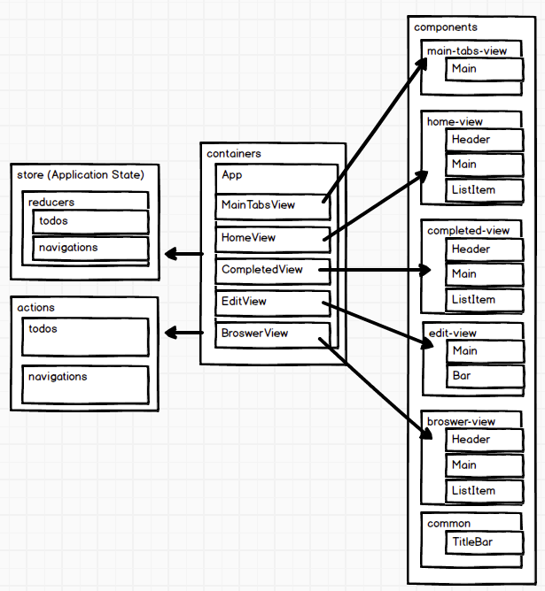


# 4.5 Naming convention

1.Containers & Components

1.1. Container file: 
```javascript
src/containers/ModuleNameView.js
```
Component files:

```javascript
src/components/module-name-view
 - index.js
 - Main.js
 - Header.js
 - ...
 - img
   - icon@2x.png
   - icon@3x.png
```

1.2. Event name: 

```javascript
handleEventName = ()=>{//todo}
...
<MyComponent onEventName={this.handleEventName}/>
```

1.3. Render methods:

```javascript
  renderMethodName = () => {
   //todo
  }
  render() {
    return (
      <View>
        {this.renderMethodName()}
      </View>
    );
  }
````
1.4. mapStateToProps & mapDispatchToProps

```javascript
function mapStateToProps(state) {
  return {
    todos: state.todos
  };
}

function mapDispatchToProps(dispatch) {
  return {
    actions: bindActionCreators(Actions, dispatch)
  }
}
```

2.actions ```src/actions```

```
index.js
todos.js
navigation.js
```

2.1```src/constants/ActionTypes.js```

```javascript
export const SWITCH_MAIN_TAB = 'SWITCH_MAIN_TAB';

```
2.2```src/actions/todos.js````
```javascript
import * as types from '../constants/ActionTypes'

export function addTodo(title, hour) {
  return {type: types.ADD_TODO, title, hour}
}
```

3.reducers```src/reducers```
```
index.js
todos.js
navigation.js
```
3.1.```src/reducers/todos.js```
```javascript
import { ADD_TODO, DELETE_TODO, EDIT_TODO, COMPLETE_TODO } from '../constants/ActionTypes'
const initialState = []

export default function todos(state = initialState, action) {
  switch (action.type) {
    case ADD_TODO:
      //todo
    default:
      return state
  }
}

```
4.styles```src/styles```

```
index.js
Basic.js
Theme.js
```
4.1```src/styles/Basic.js```

```javascript
import { StyleSheet, Dimensions } from 'react-native';
let winSize = Dimensions.get('window');
const Basic = StyleSheet.create({
  text: {
    fontSize: 32/winSize.scale
  }
});
export default Basic;

```
4.2```src/styles/Theme.js```

```javascript
//colors
const color = {
  green: '#00551e',
  brown: '#693504',
  red: '#db2828'
}

//other
const active = {
  opacity: 0.6
}

export default {color, active}
```
4.3```import {Theme, BasicStyle} from '../../styles';```

# 4.6 Resources
- [Flux](http://facebook.github.io/flux/docs/overview.html)
- [Facebook: MVC Does Not Scale, Use Flux Instead ](https://www.infoq.com/news/2014/05/facebook-mvc-flux)
- [Redux](http://redux.js.org/index.html)
- [fluxchat by Bill Fisher](https://speakerdeck.com/fisherwebdev/fluxchat)
- [Introduce Flux & react in practices (KKBOX)](http://www.slideshare.net/randylien/introduce-flux-react-in-kkbox)
- [react-flux-fluent-2015 by Bill Fisher](https://speakerdeck.com/fisherwebdev/react-flux-fluent-2015)
- [Flux TodoMVC Example](https://github.com/facebook/flux/tree/master/examples/flux-todomvc)
- [Todo React Native App](https://github.com/unbug/TodoRN)


# 5 Data
1.[Networking](http://facebook.github.io/react-native/releases/0.30/docs/network.html)
 - Fetch
 - XMLHttpRequest API
 - WebSocket


# 5.1 Fetch

1.apply [redux-thunk](https://github.com/gaearon/redux-thunk) middleware

```javascript
import { applyMiddleware, createStore, compose } from 'redux';
import thunk from 'redux-thunk';
import createLogger from 'redux-logger';
import reducers from '../reducers';

var middlewares = compose(applyMiddleware(thunk), autoRehydrate());

export default function configureStore() {
  const store = createStore(reducers, undefined, middlewares);
  return store;
}

```

2.start & end action types

```javascript
//todo action types
export const START_FETCH_ALL_TODOS = 'START_FETCH_ALL_TODOS';
export const FETCH_ALL_TODOS = 'FETCH_ALL_TODOS';
```
3.fetch flow
```javascript
import * as types from '../constants/ActionTypes';
import * as APIs from '../constants/ServerAPIs';


function shouldFetchAllTodos(state) {
  const data = state.todos;
  if (data && data.isFetchingAllTodos) {
    return false
  }
  return true;
}

export function fetchAllTodos() {
  return async (dispatch, getState) =>{
    //verify
    if(!shouldFetchAllTodos(getState())){
      return Promise.resolve();
    }

    //dispatch fetch start action
    dispatch({type: types.START_FETCH_ALL_TODOS});

    //fetching
    const response = await fetch(APIs.allTodos);
    //response
    const data = await response.json();

    //dispatch fetch end action
    return dispatch({
      type: types.FETCH_ALL_TODOS,
      data
    });
  }
}
```

4.reducer

```javascript
export default function todos(state = initialState, action) {
  switch (action.type) {
    case types.START_FETCH_ALL_TODOS:
      return Object.assign({}, state, {isFetchingAllTodos: true});

    case types.FETCH_ALL_TODOS:
      return Object.assign({}, state, {
        isFetchingAllTodos: false,
        data: action.data.data.reduce(function (pre, cur) {
          //remove duplicates
          !pre.find( key=> key.id===cur.id) && pre.push(cur);
          return pre;
        }, [...state.data])
      });
    ...
    ...
    default:
      return state
  }
}
```
5.dispatch & render

```javascript
...
  componentDidMount(){
    //fetch data from server
    this.props.actions.fetchAllTodos();
  }
...
...
  renderLoading = () => {
    if (this.props.todos.isFetchingAllTodos) {
      return (
        <View style={styles.loading}>
          <Text style={styles.loadingText}>Loading...</Text>
        </View>
      )
    }
    return null;
  }
...
```

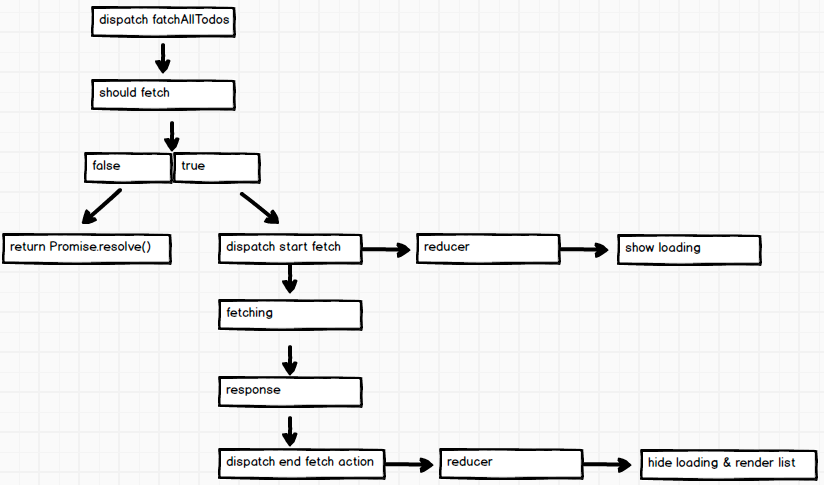


# 5.2 Persistent

1.[AsyncStorage](https://facebook.github.io/react-native/docs/asyncstorage.html)

2.apply [redux-persist](https://github.com/rt2zz/redux-persist) middlewear

```javascript
import { AsyncStorage } from 'react-native';
import { applyMiddleware, createStore, compose } from 'redux';
import thunk from 'redux-thunk';
import {persistStore, autoRehydrate} from 'redux-persist';
import reducers from '../reducers';

var middlewares = compose(applyMiddleware(thunk), autoRehydrate());

export default function configureStore() {
  const store = createStore(reducers, undefined, middlewares);
  persistStore(store, {storage: AsyncStorage});
  return store;
}

```

# 5.3 Resources

 - [Redux Async Actions](http://redux.js.org/docs/advanced/AsyncActions.html)
 - [Todo React Native App](https://github.com/unbug/TodoRN)
 
 # 6 Router

 - [NavigatorIOS](https://facebook.github.io/react-native/docs/navigatorios.html)
 - [Navigator](https://facebook.github.io/react-native/docs/navigator.html)
 
 
 # 6.1 Navigator

1.define routes

```javascript

import MainTabsView from './MainTabsView';
import EditView from './EditView';
import BroswerView from './BroswerView';

const ROUTES = { MainTabsView,  BroswerView, EditView };
```

2.config Navigator

```javascript
class App extends Component {
  renderScene = (route, navigator) => {
    let Scene = ROUTES[route.name];
    return <Scene {...route} navigator={navigator}/>;
  }
  configureScene = (route, routeStack) => {
    switch (route.name){
      case 'EditView':
        return Navigator.SceneConfigs.FloatFromBottom;
      default:
        return Navigator.SceneConfigs.PushFromRight;
    }
  }
  render() {
    return (
      <View style={styles.container}>
        <StatusBar barStyle="light-content"/>
        <Navigator
          initialRoute={{name: 'MainTabsView'}}
          renderScene={this.renderScene}
          configureScene={this.configureScene}/>
      </View>
    )
  }
}
```

3.forward & back

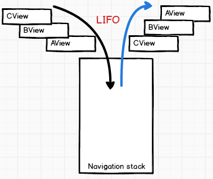


```javascript
...
  handleEdit = ()=>{
    //Navigate forward to a new scene
    this.props.navigator.push({name: 'EditView', data: this.props.data});
  }
...
```

```javascript
...
  close = ()=>{
    //Transition back and unmount the current scene
    this.props.navigator.pop();
  }
...
```
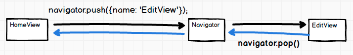


4.onDidFocus & onWillFocus

```javascript
...
componentDidMount(){
    this.currentRoute = this.props.navigator.navigationContext.currentRoute;
    this.bindEvents();
  }
  componentWillUnmount(){
    this.unBindEvents();
  }
  bindEvents = ()=>{
    this.willFocusSubscription  = this.props.navigator.navigationContext.addListener('willfocus', (event) => {
      if (this.currentRoute !== event.data.route) {
        this.setState({isVisible: false});
      }
    });
    this.didFocusSubscription  = this.props.navigator.navigationContext.addListener('didfocus', (event) => {
      if (this.currentRoute === event.data.route) {
        this.setState({isVisible: true});
      }
    });
  }
  unBindEvents = ()=>{
    this.willFocusSubscription.remove();
    this.didFocusSubscription.remove();
  }
...
```

# 6.2 Resources

- [Routing and Navigation in React Native](http://blog.paracode.com/2016/01/05/routing-and-navigation-in-react-native/)


# 7 Native Modules

Somewhere in your RN codes, insert: 

```console.log(__fbBatchedBridge);```

then in your debugger (http://localhost:8081/debugger-ui) you'll see something like below,

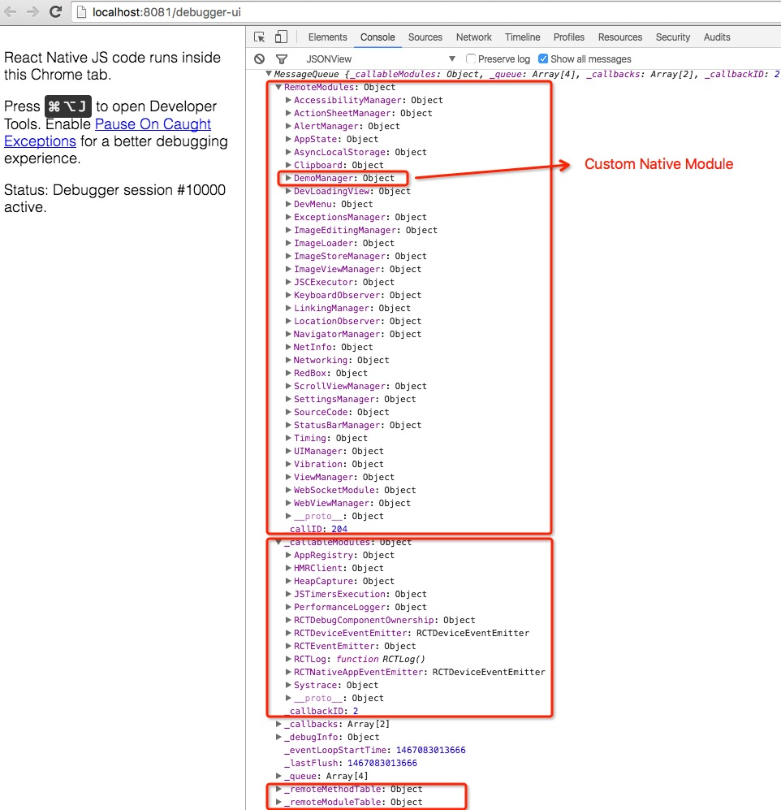
that's what we're going to talk about in this chapter.


# 8 Integration

Most of the time we are not starting a new app, we just want to use react-native to develop some new features, so integration should be a necessary skill for react-native developers.

Assume that you have create some features in the AwesomeProject, you want to create an exactly same environment for your current project.

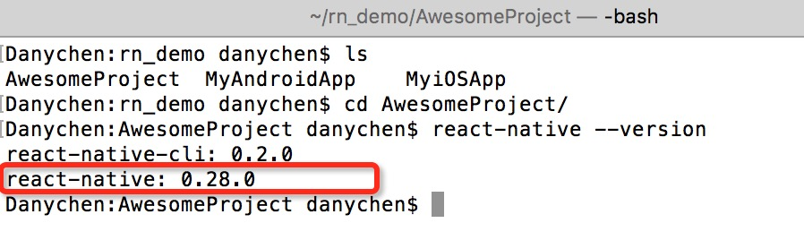

**Notice that** version is very important after your app published. If you want to upgrade react-native and package codes, that almost means you don't want to maintain the old version any longer. 


# 8.1 iOS

- 
## Cocoapods with local path

    Requirement : [CocoaPods](https://cocoapods.org/) 

    After pod **version > 1.0**, you need to identify the target. Create 'Podfile' in project root folder :
    ```
 target 'MyiOSApp' do 
	pod 'React', :path => '../../AwesomeProject/node_modules/react-native', :subspecs => [
  	  'Core',
  	  'RCTImage',
  	  'RCTNetwork',
  	  'RCTText',
  	  'RCTWebSocket',
	]
  end
    ```
    
  then ```pod install```
  
  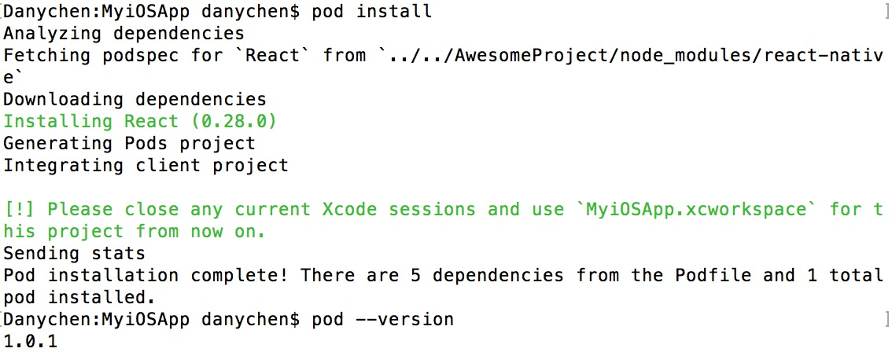
  

# 8.1.1 Package

```
react-native bundle 
--platform ios 
--dev false 
--entry-file index.ios.js 
--bundle-output ios/bundle/index.ios.bundle 
--assets-dest ios/bundle```
 
 
 # 8.2 Android

At first I followed the official instruction (which seems very simple) but lots of build or runtime
error occurs 😂.

Such as:

``` Can't find variable: __fbBatchedBridge (<unknown file>:1)```

```java.lang.UnsatisfiedLinkError: could find DSO to load: libreactnativejni.so```

```android.view.WindowManager$BadTokenException: Unable to add window android.view.ViewRootImpl$W@5d992cf -- permission denied for this window type```

But the demo works corrcetly, so I decided to copy the build settings of it. And finally it works normally on my Nexus 5X. Steps:

- Add the path to the root gradle file,
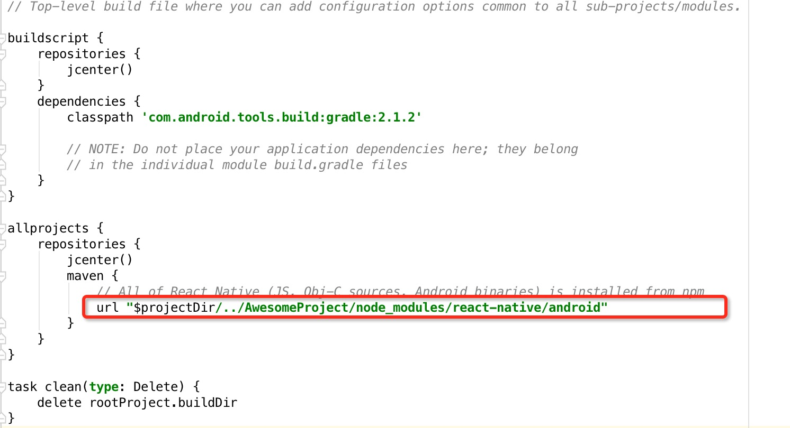

- Modify the app gradle file,
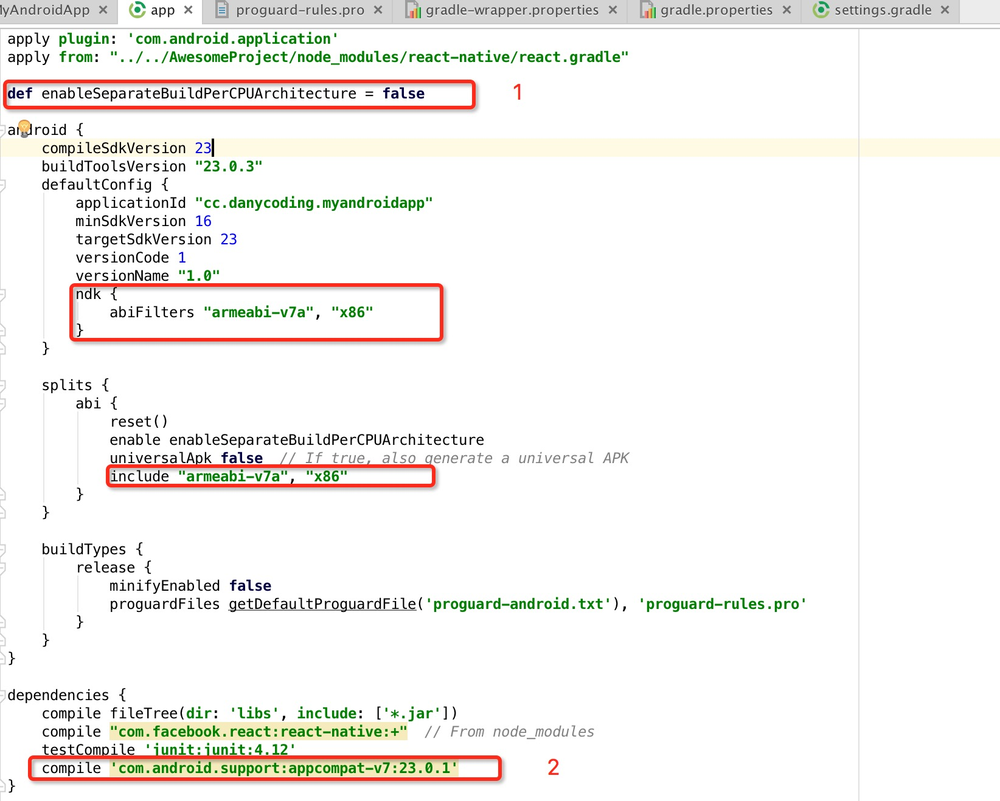

    *1. Official demo use this variable to control wheather building different apps for cpus, that will reduce the size of each app, I just ignore it here.

    *2. The version support package matters..
As react-native Android use many open source projects, if you use some of them already, you should check the version or exclude the from dependencies.  [The list currently](https://github.com/facebook/react-native/blob/master/ReactAndroid/build.gradle) 

    ```
    compile 'com.android.support:appcompat-v7:23.0.1'
    compile 'com.android.support:recyclerview-v7:23.0.1'
    compile 'com.facebook.fresco:fresco:0.11.0'
    compile 'com.facebook.fresco:imagepipeline-okhttp3:0.11.0'
    compile 'com.fasterxml.jackson.core:jackson-core:2.2.3'
    compile 'com.google.code.findbugs:jsr305:3.0.0'
    compile 'com.squareup.okhttp3:okhttp:3.2.0'
    compile 'com.squareup.okhttp3:okhttp-urlconnection:3.2.0'
    compile 'com.squareup.okhttp3:okhttp-ws:3.2.0'
    compile 'com.squareup.okio:okio:1.8.0'
    compile 'org.webkit:android-jsc:r174650'
```
- Modify root gradle.properties,
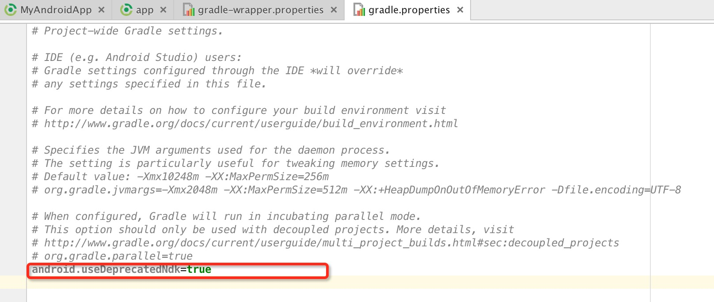

- Add proguard rules,
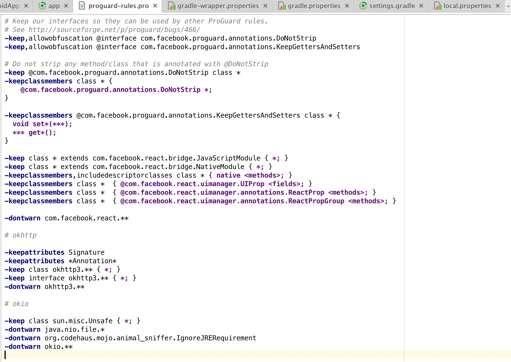

- AndroidManifest.xml, you can remove the permission if you don't need debug mode.
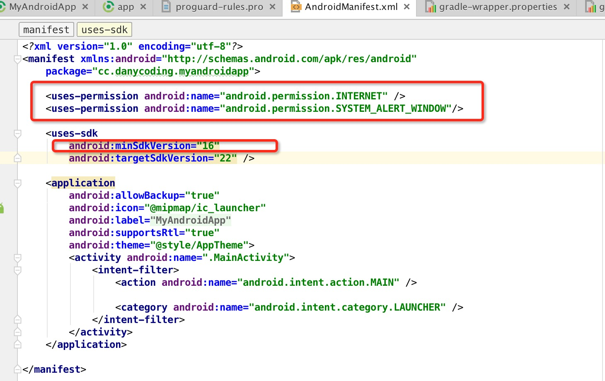


# 8.2 Android

At first I followed the official instruction (which seems very simple) but lots of build or runtime
error occurs 😂.

Such as:

``` Can't find variable: __fbBatchedBridge (<unknown file>:1)```

```java.lang.UnsatisfiedLinkError: could find DSO to load: libreactnativejni.so```

```android.view.WindowManager$BadTokenException: Unable to add window android.view.ViewRootImpl$W@5d992cf -- permission denied for this window type```

But the demo works corrcetly, so I decided to copy the build settings of it. And finally it works normally on my Nexus 5X. Steps:

- Add the path to the root gradle file,


- Modify the app gradle file,


    *1. Official demo use this variable to control wheather building different apps for cpus, that will reduce the size of each app, I just ignore it here.

    *2. The version support package matters..
As react-native Android use many open source projects, if you use some of them already, you should check the version or exclude the from dependencies.  [The list currently](https://github.com/facebook/react-native/blob/master/ReactAndroid/build.gradle) 
```
    compile 'com.android.support:appcompat-v7:23.0.1'
    compile 'com.android.support:recyclerview-v7:23.0.1'
    compile 'com.facebook.fresco:fresco:0.11.0'
    compile 'com.facebook.fresco:imagepipeline-okhttp3:0.11.0'
    compile 'com.fasterxml.jackson.core:jackson-core:2.2.3'
    compile 'com.google.code.findbugs:jsr305:3.0.0'
    compile 'com.squareup.okhttp3:okhttp:3.2.0'
    compile 'com.squareup.okhttp3:okhttp-urlconnection:3.2.0'
    compile 'com.squareup.okhttp3:okhttp-ws:3.2.0'
    compile 'com.squareup.okio:okio:1.8.0'
    compile 'org.webkit:android-jsc:r174650'
```
- Modify root gradle.properties,


- Add proguard rules,


- AndroidManifest.xml, you can remove the permission if you don't need debug mode.


# 8.2.1 Package

```
react-native bundle 
--platform android 
--dev false 
--entry-file index.android.js 
--bundle-output android/bundle/index.android.bundle 
--assets-dest android/bundle/
```

# 8.3 Before publishing

- Turn off debug Settings. 
- Implementation of exception handler.


# 8.3 Resources
 
 - [Integrating with Existing Apps - iOS](https://facebook.github.io/react-native/docs/embedded-app-ios.html) 
 - [Integrating with Existing Apps - Android](https://facebook.github.io/react-native/docs/embedded-app-android.html)
 

# 9 Hot Update (draf)

# 10 Performance

# 10.1 shouldComponentUpdate


This chapter can be applied to all react apps.
## shouldComponentUpdate

React is usually fast, but you still can improve performance by optimizing function [shouldComponentUpdate](https://facebook.github.io/react/docs/component-specs.html#updating-shouldcomponentupdate). By default it returns true, if returns false, the render function will be skipped.

This function is frequently invoked when states or props are changed. So it's important to **keep it simple and fast**.
When you called `setState`, the `render` function will always be excuted even if previous states are equal to current. This is where we can make some optimization.

[demo1](https://jsbin.com/figuse/edit?html,js,output)

In demo1, when click button, it will set same state, but render times will still increase.

[demo2](http://jsbin.com/culipes/5/edit?html,js,output)

In demo2, we check the value of name is equal to before or not, if equal return false, then we reduce the times of render function.

But if our states structure is complicated, such as `{ a: { b: { c: [1, 2, 3] }}}`, we have to compare them deeply. This is obviously against the rules we mentioned above, ** keep shouldComponentUpdate simple**


## Immutable-js
[Immutable](https://en.wikipedia.org/wiki/Immutable_object) is a concept from [functional programming](https://en.wikipedia.org/wiki/Functional_programming), one of immutable data features is that it can not be modified after being created. So there are some algorithm to create hash for every data structure(for more [detail](https://en.wikipedia.org/wiki/Persistent_data_structure)).
We can use this feature to prevent deeply compare, shallow compare is enough.
Here we will use [immutable-js](https://facebook.github.io/immutable-js/) from facebook

[demo3](http://jsbin.com/vofubiy/8/edit?html,js,output)

In demo3, we click first button several times, times will only plus one time, click second button , times will increase.

# 10.2 Resources
 - [React.js Reconciliation](https://www.infoq.com/presentations/react-reconciliation)
 - [Reconciliation](https://facebook.github.io/react/docs/reconciliation.html)
 - [Advanced Performance](https://facebook.github.io/react/docs/advanced-performance.html)
 - [Immutable-js](https://facebook.github.io/immutable-js/)
 - [ShouldComponentUpdate](https://facebook.github.io/react/docs/component-specs.html#updating-shouldcomponentupdate)
 - [Functional Programming](https://en.wikipedia.org/wiki/Functional_programming)


# Resources

- [ReactJS](https://facebook.github.io/react/)
- [React Native](https://facebook.github.io/react-native/)
- [awesome-react](https://github.com/enaqx/awesome-react)
- [awesome-react-native](https://github.com/jondot/awesome-react-native)
- [build with react](http://buildwithreact.com/)

### Books
 - [Learning React Native](http://shop.oreilly.com/product/0636920041511.do)
 - [Developing a React Edge](http://shop.oreilly.com/product/9781939902122.do)
---

## Created by [@unbug](https://twitter.com/unbug):

* [MIHTool - iOS Web Debugger Pro](https://www.mihtool.com): MIHTool helps Front-End Engineers to debug and optimize their webpages on iPad and iPhone.
* [Codelf - 变量命名神器](https://unbug.github.io/codelf/): Organize your GitHub stars and repositories. Search over projects from GitHub to find real-world usage variable names.
* [js-middleware](https://github.com/unbug/js-middleware): Powerful Javascript Middleware Pattern implementation, apply middleweares to any object. A painless solution to make codes as scalable and maintainable as ReduxJS and ExpressJS.
* [SAY NO TO SUICIDE PUBLIC LICENSE](https://github.com/unbug/snts): We've lost so many genius developers, who committed suicide, such as Aaron Hillel Swartz \(November 8, 1986 – January 11, 2013\). As a developer, the community needs you, the world needs you, please keep yourself alive.


